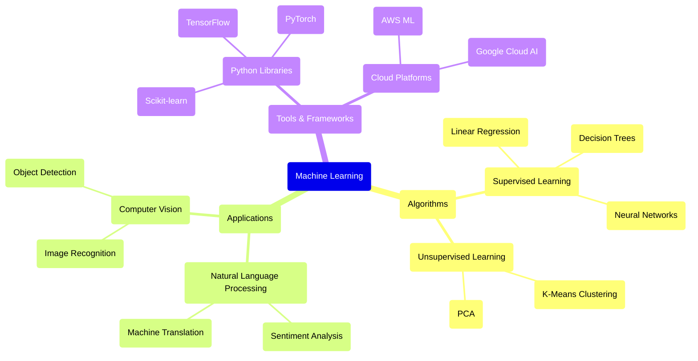

# Example Mermaid Mindmap Output

The improved mindmap endpoint now generates properly formatted Mermaid mindmap code with the following characteristics:

## Expected Output Format



## Key Improvements Made

### 1. **Enforced Double Quotes**
- All node labels now use double quotes: `("Label Text")`
- Automatic conversion of single quotes to double quotes
- Detection and fixing of unquoted labels

### 2. **Pure Mermaid Source Code**
- Removes any markdown code block wrappers
- Ensures output starts with `mindmap`
- No additional explanations or text

### 3. **Validation & Cleanup**
- Regex patterns to fix quote inconsistencies
- Proper indentation validation
- Structure verification

### 4. **Enhanced Prompt**
- Specific instructions for double quote usage
- Clear example format provided
- Emphasis on pure Mermaid syntax only

## API Response Structure

```json
{
  "topic_id": "abc123...",
  "topic_name": "Machine Learning",
  "topic_description": "Study of algorithms and models...",
  "mindmap": "mindmap\n  root(\"Machine Learning\")\n    algorithms(\"Algorithms\")...",
  "content_items_processed": 5,
  "total_content_length": 15000,
  "total_content_tokens": 3500,
  "mindmap_length": 1200,
  "processing_time_seconds": 8.5,
  "total_time_seconds": 9.2,
  "generated_at": 1642512345.6,
  "cached": false
}
```

The mindmap can be directly rendered in any Mermaid-compatible viewer or documentation system.